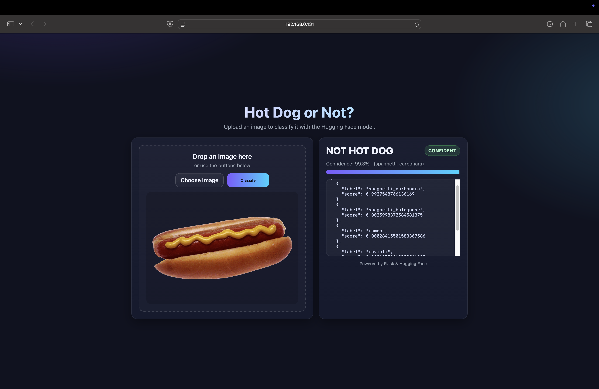
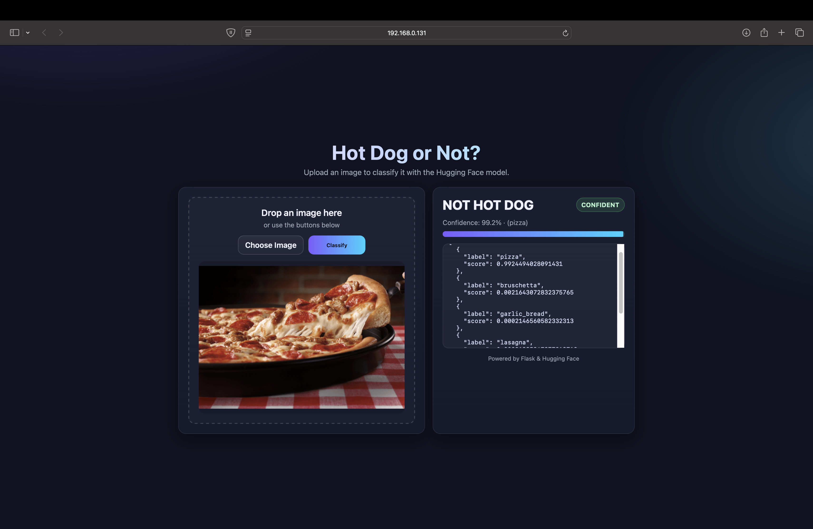
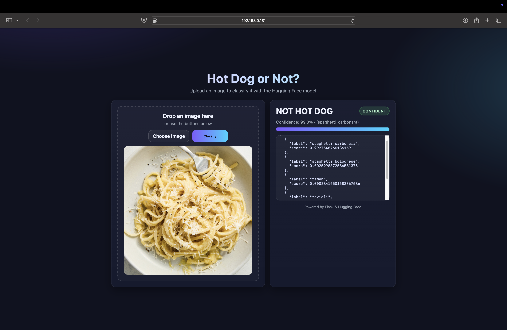
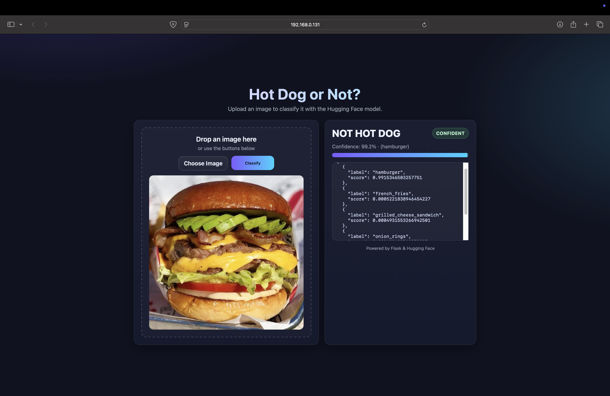

# 🌭 Hot Dog or Not Hot Dog?

A fun Flask web app that uses a Hugging Face image classification model to tell whether an uploaded image **is a hot dog** or **not a hot dog**.  
If the image is not a hot dog, the app also shows the top predicted class (e.g., pizza, burger).







---

## 🚀 Features
- Upload an image via file picker or drag-and-drop.
- Live preview of the image before submitting.
- Classification powered by Hugging Face’s hosted models.
- Confidence bar and status badges (**CONFIDENT / UNCERTAIN / LOW CONF**).
- Upload validation (type + size) and clearer backend error handling.
- Health endpoint for deployment checks: `GET /health`.
- Top-3 prediction payload returned from API for richer UI extensions.
- Raw JSON output available for debugging.
- Simple, modern UI built with HTML/CSS/JS (no external frameworks).

---

## 📂 Project Structure
```
nothotdog/
│── templates/
│   └── index.html      # Frontend UI
│── web.py              # Flask backend server
│── .env                # Environment variables (API key + model URL)
│── food_images         # Food Images

```

---

## ⚙️ Setup Instructions

### 1. Clone the repository
```bash
git clone https://github.com/your-username/nothotdog.git
cd nothotdog
```

### 2. Create and activate a virtual environment
```bash
python3 -m venv .venv
source .venv/bin/activate   # macOS/Linux
# On Windows:
# .venv\Scripts\activate
```

### 3. Install dependencies
```bash
pip install -r requirements.txt
```

If you don’t have a `requirements.txt` yet, here are the core packages:
```txt
flask
requests
python-dotenv
```

### 4. Add your Hugging Face API credentials
Create a `.env` file in the project root:

```dotenv
HUGGING_FACE_API_URL=https://api-inference.huggingface.co/models/nateraw/food
HUGGING_FACE_API_KEY=hf_xxxxxxxxxxxxxxxxxxxxxxxxx
```

- Replace the URL with the model you want (e.g., `nateraw/food` or `julien-c/hotdog-not-hotdog`).
- Get your API key from [Hugging Face Settings → Access Tokens](https://huggingface.co/settings/tokens).

### 5. Run the Flask app
```bash
python web.py
```

By default, the app runs at:
```
http://127.0.0.1:81
```

Health check:
```bash
curl http://127.0.0.1:81/health
```

---

## 🖥️ Usage
1. Open the app in your browser.  
2. Upload or drag an image (hot dog, burger, pizza, etc.).  
3. Get instant classification:  
   - **Hot Dog** → confidently recognized as a hot dog.  
   - **Not Hot Dog** → shows the top class in parentheses (e.g., *pizza*).  

---

## 🛠️ Tech Stack
- **Backend:** Python, Flask  
- **Frontend:** HTML, CSS, Vanilla JavaScript  
- **ML Model:** Hugging Face Food-101 / Hotdog classifier  

---

## 📸 Example
- Input: 🍕 Pizza image  
- Output:  
  ```
  NOT HOT DOG
  Confidence: 92.1% · (pizza)
  ```

---

## 📜 License
MIT License. Free to use and modify.

---

## 🙌 Acknowledgements
- Hugging Face for the awesome model hosting.  
- Food-101 dataset & Hotdog-NotHotdog meme inspiration.

---

## 🧪 Testing
```bash
python -m pytest -q
```
